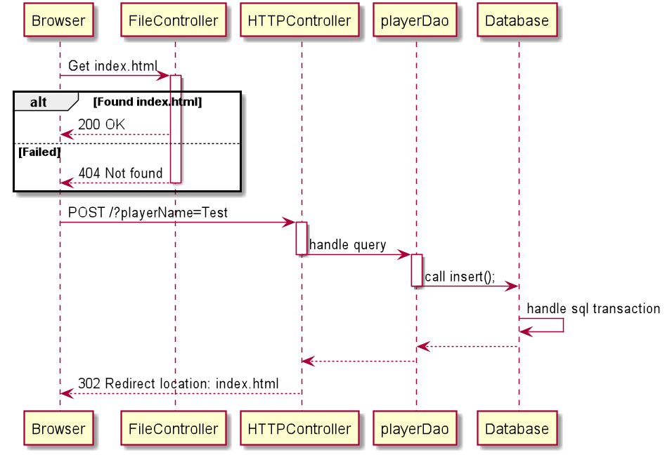
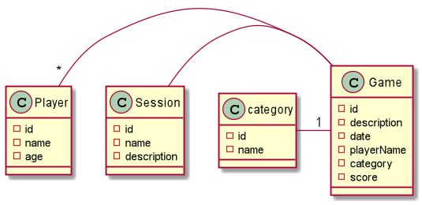

# PG203 Mappeinnlevering for gruppe <wiseflow gruppenummer>

- [omamoh18](https://github.com/omamoh18)
- [RahilVaseer](https://github.com/RahilVaseer)

## Hvordan kjøre dette programmet

### Bygg og test executable jar-fil

* Først klone prosjektet
* kjør mvn `clean package`
* legg til `task-manager.properties file`
* legg til `dataSource.url`
* legg til `dataSource.username`
* legg til `dataSource.password`
* For å starte programmet 
kjør kommandoen`java -jar target/yatzy-game-1.0-SNAPSHOT.jar` i terminalen

### Funksjonalitet

##### Programmet er et Yatzi-spill der man kan: 
* Etter å ha åpnet opp serveren, kan du koble deg til `locahost:8080`
* Opprette `players`
* Diregere seg til `gameroom`
* Gi navn til `gameroom`
* Lage en `game`
* Liste ut dine tidligere runder av `yatzygamene`

## Designbeskrivelse:

### Client-Server-model:

Klienten spør etter en fil ved bruk av en `GET` forespørsel , der serveren kaller på en filkontroller som håndtere spørringen. Serveren sender da en response tilbake og klienten får tilbake fila som den ønsker.

Da klienten sender ut en `POST` forespørsel så vil serveren kalle på en kontroller som skal håndtere parsing av query og dao vil kalle på en av funksjonene/metodene sine blant annet som `insert` som sender data inn til databasen.

### Dao-model:

Alle klassene som har arvet fra `AbstractDao` har sine egne resultset. Dette vil si at når vi skal prøve å lese fra databasen og det ved å kalle på `ListAll`, vil funksjonen/metoden `listAll` fra den `abstrakte` klassen bli kalt på og utføre en `SELECT` som da vil gi oss de korrekte tabellene tilbake.

Spilleren skriver in navn, alder. Lager så nytt spill, der han "kaster" terningene, velger kategori i menyen "category", velger spilleren sitt navn i menyen "players" og trykker på "submit" knappen, 
for å bekrefte valgene sine. 

### Prossess og evaluering av samarbeid

Da dette er vår konteeksamen så har vi vært gjennom en eksamen i avansert Java tidligere. Vi har jobbet sammen i gruppe f.om arbeidskrav 3, og føler vi har en bra kjemi, og valgte derfor å jobbe sammen i konteeksamen også. Vi startet først med å gå igjennom tilbakemeldinger vi fikk fra tidligere innlevert eksamen, og la opp en plan på hvordan veien skulle bli videre med de tilbakemeldingene i betraktning. Dette gjorde vi ved å drøfte og lufte ideer slik at vi kunne komme i enighet i felleskap, og finne den best mulige løsningen for oss. 

Vi har drevet med par-programmering fra oppstart av faget, og vi har derfor programmert store deler av koden vår fra EN pc der en har programmert mens den andre har hatt en helhetlig oversikt over koden. Vi har byttet på rollene underveis slik at begge fikk prøvd seg. Det har vært en intens omgang med koding i løpet av de tre dagene vi hadde eksamen. Vi møttes på vårt lokale bibliotek da vi bor på samme området, og fant det praktisk. Vi jobbet også over nett på Discord da biblioteket ble stengt, og vi dro hjem hver for oss. Par-programmering har gitt oss muligheten til å samarbeide med hverandre, og vi føler at vi har virkelig fått det til! *High five* 
Vi fant det skikkelig gøy å par-programmere. Det fikk oss til å være mer verbale, og samkjørte. Eneste ulempen som vi kan tenke oss med par-programmering er at man bruker lengre tid med å kode enn det man hadde gjort alene (?) da det blir brukt tid på å drøfte og forhøret seg med respektive partneren enn det det hadde gjort alene.   

### Egenevaluering:

Vi har prøvd å holde en god struktur i vårt arbeid da vi kun hadde 3 dager på oss. Vi startet dag 1 med å legge mål for hvert av dagene som vi hadde til eksamen. Dette for å holde kontroll på hva vi trenger å gjøre, og hvor mye som er gjort. Noe som var svært viktig med tanke på at vi hadde så få dager på å bli ferdig.

Vi har prøvd å følge instruksene som ble gitt ut i oppgave teksten. Vi har prøvd så godt vi kan å oppnå de fleste av kriteriene for å få topp karakter, Vi føler at på tre dager så har vi fått til mye som vi er stolte over. Vi er klare over at kanskje noe steder i koden så kunne vi ha refaktorert litt, men på grunn av lite tid og en omvending i oppgaveteksten fra i fjor så har vi fått til ett resultat som vi kan levere må stolthet. 
Noen av hovedfokusene våre har vært TDD, få til så mye av Spill logikken til yatzy som vi kunne og sjekke så mange kryss av bokser som vi kunne. TDD var nytt for oss i fjor, men i år så har vi mer tester og en god «coverage» av koden. Vi har gjort en del parprogrammering, derfor har vært det en god del commit fra en pc. 
Det har vært mye lærdom gjennom denne eksamen, vi tok ikke nytte av parprogrammering sist eksamen og det endte opp med mye forivrelse og usikkerhet om hvordan slutt produktet skulle være. Denne gangen satt vi sammen snakket gjennom kodingen vår. 
Vi synes at logikken for spillet er godt implementert, kunne ha blitt bedre ettersom koden er litt redundant, men spill ender opp med en del slike setninger. 
Vi har gjort mye annerledes fra i fjor så vi kan si at vi har fått vår dose kunnskap, men hvem sier at man ikke kan lære mer? 
Derfor kan det legges fram at vi kunne ha vært flinkere til å refaktorere, legge en større plan for kodingen i seg selv. Vi hadde store planer, men var redde for å ende opp med lite tid og derfor kan planlegning til neste eksamen være bedre. Vi fikk ikke tid til full CRUD mekanismen gjennom gui’en, vi har det i selve koden og det fungerer til en god grad, men skulle ønske vi hadde mer tid for å kunne få implementert det.
Vi har mer forståelse av hva dette faget gikk ut enn sist gang, sist var sjokket av å se en test for første gang overveldende, men nå kan vi ikke se for oss ett prosjekt uten å skrive tester. 
Den vi skulle lage isssues for sa til oss at han ikke skulle levere eksamen. 
 

 
  
	

